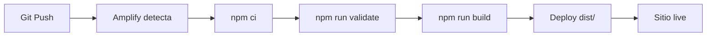

# Guía de Despliegue - Celula Site v2.0

## 🚀 Deploy Rápido

```bash
# 1. Validar proyecto
npm run validate

# 2. Build
npm run build

# 3. Push a Git (Amplify detectará automáticamente)
git add .
git commit -m "Deploy"
git push origin main
```

## 📋 Pre-requisitos

### Configuración Local

- Node.js 18+
- npm o yarn
- Git

### Variables de Entorno

Debes configurar en AWS Amplify Console:

```env
RESEND_API_KEY=tu_api_key       # Requerido para emails
GEMINI_API_KEY=tu_api_key       # Requerido para chatbot
CONTACT_EMAIL=email@ejemplo.com # Email de contacto
```

## 🏗️ Build Local

### Validar antes de desplegar

```bash
npm run validate
```

Esto verifica:
- Referencias CSS válidas
- Referencias JS válidas
- Referencias de assets
- Sintaxis básica

### Build completo

```bash
npm run build
```

Proceso:
1. Ejecuta validación
2. Minifica CSS
3. Minifica JS
4. Procesa HTML
5. Copia assets
6. Genera output en `dist/`

### Verificar build

```bash
ls -la dist/
du -sh dist/
```

## ☁️ AWS Amplify (Recomendado)

### Configuración Inicial

1. **Conectar repositorio**
   - AWS Amplify Console
   - "New app" → "Host web app"
   - Conectar GitHub/GitLab

2. **Configurar build**
   - Archivo: `amplify.yml` (ya incluido)
   - Build command: `npm run build`
   - Output directory: `dist`

3. **Variables de entorno**
   - App settings → Environment variables
   - Agregar: `RESEND_API_KEY`, `GEMINI_API_KEY`, `CONTACT_EMAIL`
   - Marcar como "Secret" las API keys

4. **Funciones serverless**
   - Automáticas desde `functions/api/`
   - Rutas: `/api/send-email`, `/api/chatbot`

### Deploy Automático

Cada push a la rama principal:
1. Amplify detecta cambios
2. Ejecuta build
3. Despliega desde `dist/`
4. Aplica headers HTTP

### Monitoreo

- Build logs en Amplify Console
- Errores visibles en tiempo real
- Rollback automático si falla

## 🔍 Debugging

### Build falla

```bash
# Ver logs de Amplify
# O ejecutar localmente:
npm run build

# Si hay errores de validación:
npm run validate
```

### Funciones no responden

- Verificar variables de entorno en Amplify
- Ver logs de Lambda Functions en Amplify Console
- Test local: `npm run dev`

### Assets no cargan

- Verificar rutas en `src/html/`
- Ejecutar `npm run validate`
- Confirmar que assets existen en `src/assets/`

## 📊 Optimización Post-Deploy

### Performance

```bash
# Test con Lighthouse
npx lighthouse https://tu-sitio.amplifyapp.com
```

### Cache

Headers configurados en `_headers`:
- HTML: 1 hora
- CSS/JS: 1 año (immutable)
- Assets: 1 año (immutable)

### CDN

Amplify CloudFront incluido automáticamente

## 🔐 Seguridad

### Headers HTTP

Configurados en `_headers`:
- X-Frame-Options: DENY
- X-Content-Type-Options: nosniff
- Referrer-Policy: strict-origin-when-cross-origin
- Permissions-Policy

### Secrets

- ✅ Nunca en código
- ✅ Solo en variables de entorno
- ✅ Marcadas como "Secret" en Amplify

## 📈 Rollback

En caso de error:

```bash
# En Git
git revert HEAD
git push origin main

# O en Amplify Console
# Deployments → Redeploy versión anterior
```

## 🔄 CI/CD Pipeline



## 📋 Checklist Pre-Deploy

- [ ] `npm run validate` pasa
- [ ] `npm run build` funciona localmente
- [ ] Variables de entorno configuradas en Amplify
- [ ] Cambios commiteados
- [ ] Rama principal actualizada
- [ ] Tests manuales locales completados

## 🆘 Troubleshooting

### "Module not found"

```bash
# Reinstalar dependencias
rm -rf node_modules package-lock.json
npm install
```

### "Build failed"

```bash
# Ver error específico en logs de Amplify
# Reproducir localmente:
npm run build
```

### "Function timeout"

- Aumentar timeout en Amplify Console
- Optimizar función en `functions/api/`

### "Assets 404"

- Verificar estructura `dist/`
- Confirmar rutas en HTML
- Revisar `amplify.yml` baseDirectory

## 📞 Soporte

- Logs: AWS Amplify Console
- Monitoring: CloudWatch
- Documentación: Este archivo (`/docs/DEPLOYMENT.md`)

---

**Última actualización**: 2025  
**Versión**: 2.0.0
